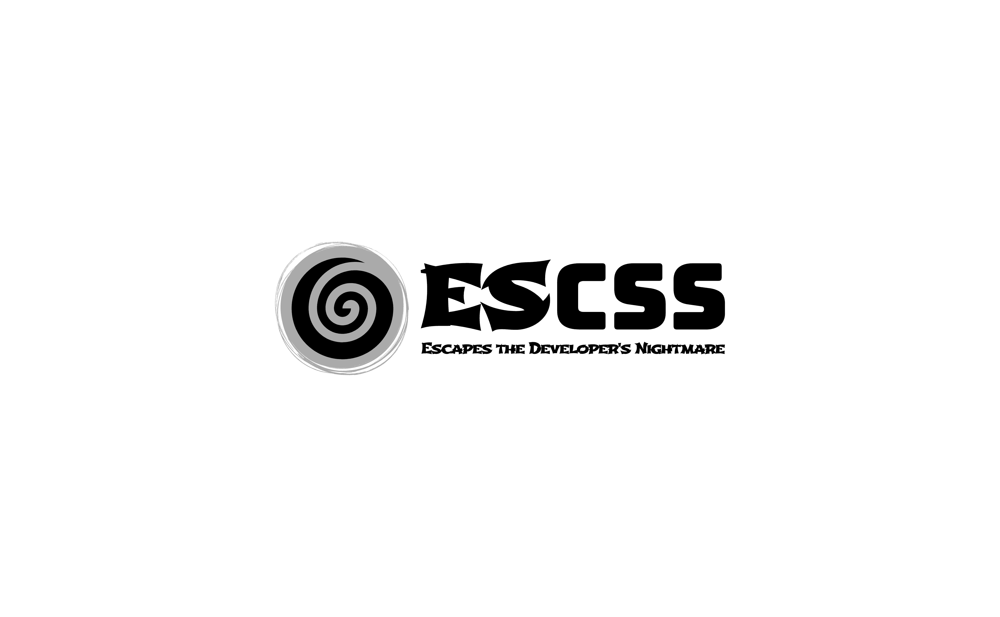
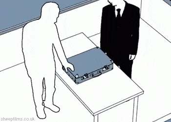
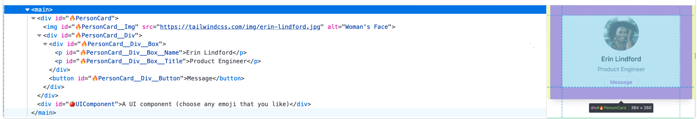

## What is ESCSS?

  - ESCSS = extra structure (BEM) CSS + pay tribute to ECMAScript
  - ESCSS (pronounced 'escapes') is a Silver Bullet methodology, inspired by The Mythical Man-Month, designed to resolve software dilemmas and reduce developer frustration.

## Is ESCSS the Silver Bullet?
### I think it is, and here's why
  1. CSS and JavaScript have ranked in the Top 3 on Stack Overflow from 2017 to 2024 and work well across different platforms like websites, apps, and games.
  2. While CSS and JavaScript are easy to use, they can be challenging to maintain. That's where ESCSS comes in to simplify and enhance the process.
  3. ESCSS combines object-oriented programming with a pure functional paradigm.


## Core Concept - Essence Complexity
  Group similar stuff, extract common elements, and repeat endlessly.

  
  
## Example
  An example of CardVue.vue(component) using [ESCSS-ESTest](https://github.com/ESCSS-labs/ESCSS-ESTest) & [ESCSS-SCSS](https://github.com/ESCSS-labs/ESCSS-SCSS)

  ```vue
  <script setup>
  import { ESTest } from 'escss-estest';

  const CardVue = {
    data: {
      enable: true,
    },
    in: {
      reuse: {
        getWord: (word) => {
          {
            ESTest(word, 'string', 'mike 09092024 4')
          }

          console.log(word)
        }
      },
      getGreeting: () => {
        CardVue.in.reuse.getWord('Hello world')
      },
    },
    out: {
      sum: (a, b) => {
        {
          ESTest(a, 'number', 'mike 09092024 1')
          ESTest(b, 'number', 'mike 09092024 2')
          ESTest(CardVue.data.enable, '===', true, 'mike 09092024 3')
        }

        CardVue.in.getGreeting()
        return a + b
      }
    }
  }

  CardVue.out.sum(1, 2)
  </script>

  <template>
    <main>
      <div id="🔥PersonCard">
        
        <div id="🔥PersonCard__Div">
          <div id="🔥PersonCard__Div__Box">
            <p id="🔥PersonCard__Div__Box__Name">Erin Lindford</p>
            <p id="🔥PersonCard__Div__Box__Title">Product Engineer</p>
          </div>
          <button id="🔥PersonCard__Div__Button">Message</button>
        </div>
      </div>

      <div id="🍎UIComponent">
        A UI component (choose any emoji that you like)
      </div>
    </main>
  </template>

  <style lang="scss">
  @include utils_base-preflight-v3-modify; // built-in base css

  #🍎UIComponent {
    margin-top: 20px; // use vanilla css
    @include bg-green-300; // use tailwind utility in Sass
    @include utils_reset-tw; // reset tailwind variables
  }

  #🔥PersonCard {
    @include py-8;
    @include px-8;
    @include max-w-sm;
    @include mx-auto;
    @include bg-white;
    @include rounded-xl;
    @include shadow-lg;
    @include space-y-2;

    @include sm {
      @include py-4;
      @include flex;
      @include items-center;
      @include space-y-0;
      @include space-x-6;
    }

    @include utils_reset-tw;
  }

  #🔥PersonCard__Img {
    @include block;
    @include mx-auto;
    @include h-24;
    @include rounded-full;

    @include sm {
      @include mx-0;
      @include shrink-0;
    }

    @include utils_reset-tw;
  }

  #🔥PersonCard__Div {
    @include text-center;
    @include space-y-2;

    @include sm {
      @include text-left;
    }

    @include utils_reset-tw;
  }

  #🔥PersonCard__Div__Box {
    @include space-y-0\.5;
    @include utils_reset-tw;
  }

  #🔥PersonCard__Div__Box__Name {
    @include text-lg;
    @include font-semibold;
    @include utils_reset-tw;
  }

  #🔥PersonCard__Div__Box__Title {
    @include text-slate-500;
    @include font-medium;
    @include utils_reset-tw;
  }

  #🔥PersonCard__Div__Button {
    @include px-4;
    @include py-1;
    @include text-sm;
    @include text-purple-600;
    @include font-semibold;
    @include rounded-full;
    @include border;
    @include border-purple-200;

    &:hover {
      @include text-white;
      @include bg-purple-600;
      @include border-transparent;
    }

    &:focus {
      @include outline-none;
      @include ring-offset-2;
      @include ring-2;
      @include ring-purple-600;
    }

    @include utils_reset-tw;
  }
  </style>
  ```
### Demo
  

### 1. JavaScript part
#### Mutation: 
  - I think Mutations can be more efficient than immutable operations.
  - Use ESCSS-ESTest to make functions to be pure function.

### 2. CSS part
#### ID: 
  - Keep HTML clean.
  - Maintain flat specificity (1,0,0) in general.
  - Handle Bootstrap !important situation.

#### Status Class: 
  - Use !important by design to override IDs.

  ```scss
  .--active {
    background: red !important;
  }
  ```

#### Developer Experience: 
  - Increase devtool readability.
  - Suggest to use case 2 for easy to copy/search/replace
  ``` scss
  <!-- case 1 -->
  #🔥PersonCard {
    // ...
    &__Img {
      // ...
    }
  }

  <!-- case 2 -->
  #🔥PersonCard {
    // ... 
  }
  #🔥PersonCard__Img {
    // ...
  }

  ```

#### Naming Convention:
  - PascalCase: 🔥CardVue (follows component name for consistency).
  - Double Underscore (__): 🔥Card__Box__CardText.
  - Double hyphen(--) in status class: --dark、--active
  - Emojis for organization/readability: Page component (🌀), component (🔥)、UI component(choose any emoji that you like).
  - Meaningless element: Follow the element name (e.g., 🔥Card__Box__A).

  **This is my favorite version, you might have different prefer but you got the idea**